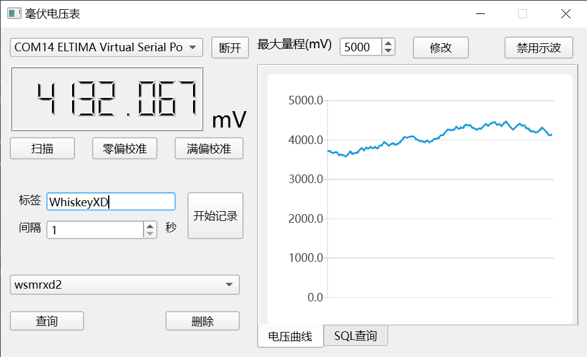

注意: 现master分支为Qt实现版本，MFC实现版本已移动至分支`MFC_Ver`
# VoltMeter：简单的GUI电压采集软件

8051MCU代码仓库：[VoltMeter_C51](https://github.com/SignedWhiskeyXD/VoltMeter_C51)

## 简介

这是WHUT机电学院测控技术与仪器专业的课程设计的一部分

该仓库仅供学习研究使用，不具备太多实用价值

## 用途

接受来自MCU的采集的电压数据，可视化显示在软件前台

具备仿示波器功能，通过SQL对记录数据进行增删查

通过向MCU发送指令，执行校准等操作

兼容任何使用不超过16位AD进行采集的MCU，要求按以下顺序通过串口连续发送6个字节作为数据帧：

- ASCII字符`W`
- ASCII字符`S`
- ASCII字符`K`
- 8位无符号整型数：如果AD模块前置了PGA，该字节表示**PGA的增益倍数**

16位AD转换结果：

- 16位无符号整型数：**高8位**
- 16位无符号整型数：**低8位**

此程序会向MCU发送单字节指令：

- ASCII字符`0`：执行零偏校准
- ASCII字符`1`：执行满偏校准

是否执行校准取决于MCU程序的实现，也可以忽略

## 依赖

- ISO C++11
- Qt 6.2.4
- [CSerialPort](https://github.com/itas109/CSerialPort)
- [spdlog](https://github.com/gabime/spdlog)
- [Poco DataSQLite](https://github.com/pocoproject/poco)

你可以使用[vcpkg](https://github.com/microsoft/vcpkg)安装以上依赖：

~~~shell
vcpkg install cserialport spdlog
vcpkg install poco[core,sqlite3]
~~~

本项目于Windows10， VS2022构建，其它平台暂未测试

## 构建
使用Git克隆本仓库：
~~~shell
git clone https://github.com/SignedWhiskeyXD/VoltMeter.git
~~~

使用CMake构建项目：
- 通过支持CMake的IDE打开本项目（例如VSCode CLion等），并通过`CMakeLists.txt`对项目进行配置
- 或者，你可以通过以下命令构建：
~~~shell
mkdir build
cd build
cmake ..
cmake --build .
~~~
虽然是拿Qt写了，但是我还没测试其它平台下的可移植性

~~然而我被发配去进厂了，手里的笔记本只有服务器版Linux，就懒得测试~~